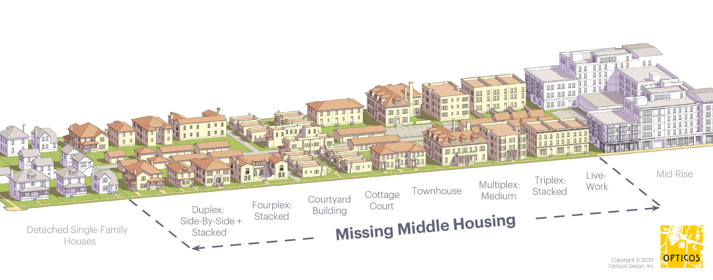

--- 
title: "Travel Behavior and Urban Land Use"
author: 
- Shen Qu^["Portland State University, Toulan School of Urban Studies and Planning"]
date: "`r Sys.Date()`"
site: bookdown::bookdown_site
output: 
  bookdown::gitbook: 
    lib_dir: "book_assets"
    includes:
      after_body: disqus.html
  bookdown::pdf_book:
    toc: true
    toc_depth: 4
  citation_package: biblatex
documentclass: book
bibliography: [fieldpaper.bib, book.bib, packages.bib]
biblio-style: apalike
link-citations: yes
github-repo: qushen26/field_paper
description: "This is a field paper using the bookdown package. The output format for this example is bookdown::gitbook."
abstract: |
  Part I reviews the literature of theories and studies in Travel Behavor and Built Environment.
  
  Daily Driving Distance as the variable of interest, is associated with many factors including Built-Environment variables. Population Density may have more potential to explain the driving distance than people ever thought about.
  
  Part II iintroduces the linear/non-linear models and meta-analysis methods applied on this topic.
  
keywords: travel behavior, urban land use, probability distribution
header-includes:
   - \usepackage{amssymb}
   - \usepackage{amsmath}
   - \usepackage{fancyhdr}
   - \pagestyle{fancy}
   # - \fancyhead[CO,CE]{\thesection}
   # - \fancyfoot[CO,CE]{\thesection}
   # - \fancyfoot[LE,RO]{\thepage}
   # - \fancyhf{}
   # - \rhead{\thechapter}
   # - \chead{Field Paper}
   # - \lhead{\thesection}
   # - \rfoot{Page \thepage}
   - \usepackage{setspace}\doublespacing
   - \usepackage{subfig}
   - \usepackage{multicol}
   - \usepackage{multirow}


---

# Preface {-}

This is a field paper using the **bookdown** package [@R-bookdown], **knitr** [@xie2015] and TinyTeX: <https://yihui.name/tinytex/>.


```{r setup, include=FALSE}
# knitr::opts_chunk$set(
#   tidy=FALSE,     # display code as typed
#   size="small")   # slightly smaller font for code
# devtools::install_github('rich-iannone/DiagrammeR')
# remotes::update_packages(c("DiagrammeR", "tinytex", "rmarkdown", "knitr"))
# remotes::install_github('rstudio/rmarkdown')
library(pacman)
p_load(tidyverse,kableExtra ,mosaic,ggpubr,factoextra, DiagrammeR,magrittr) #
# if (!require("webshot")) {install.packages("webshot")}
# webshot::install_phantomjs()

knitr::opts_chunk$set(eval=F,echo=F, message=F, warning=F,cache=T,fig.dim = c(8, 6),fig.align = 'center') #,fig.pos="!h"
```


```{r eval=FALSE}
install.packages("bookdown")
# or the development version
# devtools::install_github("rstudio/bookdown")
bookdown::publish_book(account="")
```


```{r include=FALSE}
# automatically create a bib database for R packages
knitr::write_bib(c(
  .packages(), 'bookdown', 'knitr', 'rmarkdown'
), 'packages.bib')
```


<!--chapter:end:index.Rmd-->

# (PART\*) Part I Theories and Framework {-} 

# Introduction {#intro}

In the past decades, efforts have been made to reduce Automobile Dependency in both developed and developing counties. Many research have found that moderating the car use have positive social, economic and environmental impacts. The negative externalities of automobile include, but are not limited to, congestion, collision, unhealthy lifestyle, urban sprawl, social segmentation, pollution, and Greenhouse Gas (GHG) emission.

Three dimensions can reflect the degree of car use, travel mode, driving frequency, and driving distance.
Previous studies commonly choose two metrics for measuring them, the share of auto trips (or other modes) and Vehicle Miles Traveled (VMT) ^[or Vehicle Kilometers Traveled (VKT)].

The share of mode is calculated by dividing the number of chosen mode over the total number of trips.
The main travel modes, transit, bicycle, and walking are the alternatives to driving personal car.
Given the same amount of travel demand, more active and transit modes means less car use.
VMT is used to measure the travel distance made by a private vehicle.
An integrated viewpoint is to treat the non-auto trips as zero-VMT.
In this way, the probability distribution of VMT can comprehensively represents the travel behavior. 


The smallest unit of VMT is recorded by trip from a daily travel survey. Then these records can be aggregated to personal or household daily VMT (DVMT).
A traveler's or household's DVMT can account for the degree of automobile dependency by combining the number of trips and driving distance during a day.
Given the survey day is randomly selected, DVMT can reflect the typical travel pattern in general.

Although, there are other approaches collect weekly, monthly, or longer VMT records by tracking car usage.
The odometer records are more likely to represent the usage of vehicle rather than traveler's behavior.
It is not easy to acquire long-term VMT through survey-based method. The annual mileage and fuel efficiency information provided in some public data usually are estimated values using daily records and are not as accurate as DVMT.

On a personal scale, VMT relates to the economic cost of travel by car, while another dimension, travel time measuring the time cost of vehicle travel.
For society as a whole, the total VMT measures the usage of road network. 
Thus, it acts as a major interest within the field of transportation, especially in the research of travel demand and infrastructure capacity. 
And VMT highly correlated with the amount of fuel consumption, which is one of the main indicators of pollution and GHG emission. It is also one of the priority issues involving sustainable development and climate change.

Previous research found that reducing VMT is instrumental in solving some urban problems and improving the qualities of urban life.
It is natural that urban studies try to figure out the relationship between VMT and some urban built-environment factors. Then urban or regional policies could identify the best practices to contribute VMT reduction.


<!--chapter:end:files/01-intro.Rmd-->

# Travel Behavior Theories

Two different perspectives, individual and collective, can explain travel behavior.
When people contextualizing travel as a personal choice or decision-making, the traveler as a subject make mode choices, driving or not.
When travel behavior is understood as a social phenomenon, researcher observe and understand the trips as a whole.
The two perspectives derived two schools of theory, mode choice and human mobility.
In the school of mode choice, travel distance could be treat as an independent variable, a part of travel cost, or could be decided in the next step after mode choice , such as route choice.
In the school of human mobility, driving distance grab more attentions.


## Mode Choices (Travel as a subject)

Are 'decision' and 'choice' the same when discussing travel modes?
Literally, a 'choice' is one decision given all available options at the same time. While 'decision' is a broader concept. A decision could be a schedule with a combination of many choices, such as modes, destination, and activities. A decision related to travel behavior could even include bicycle or car purchase, and relocation.
This section will start from the theories of mode choice, then extend to a broader discussion of decision processes.

### Rational Choice Theory

For prescriptive, analytical everyday decision-making, rationality is a basic assumption in reasoned behavior or rational choice theories (Edwards, 1954,Von Neumann and Morgenstern, 1944)(von Neumann and Morgenstern, 1947; Savage, 1954).

This category is also called 'Normative Decision Theory', which assume people a traveler is an ideal decision maker who are full rational.
It requires three necessary steps including information collection, utility evaluation, and choice making.

- Expected Utility Theory (EUT)

Traditional economics focus on the utility evaluation and come up with the Expected Utility Theory (EUT) which is also called Consumer Choice Theory.
The rule of EUT is Random Utility Maximization (RUM) (Ben-Akiva & Lerman, 1985; Daneil McFadden, 1973).
This classical theory claims that customer always choose the one most appropriate by comparing the advantages and disadvantages of a range of alternatives, evaluating the benefits and costs of each possible outcome.
Eventually travelers will select the optimal solution with the maximum 'utility' from the choice set.

In real life, Rational Choice Theory can not accurately describe the actual human behavior.
Individuals do not often collect and analyse all the relevant information.
They are not 'ideal' and are not able to calculate the utility for all possible alternatives with perfect accuracy.
In many cases, the travel decision is not regarded as the 'best' one to achieve travelers' desired objective.
Many other theories were developmed to fix these issues.

### Prospect Theory

Kahneman and Tversky (1979) introduced the [Prospect Theory](https://www-sciencedirect-com/topics/social-sciences/prospect-theory) to study the impacts of biases.
Prospect Theory is a descriptive theory with three main components: First, people are more sensitive to the sure things (e.g., the probability between 0.9 and 1.0, or between 0.0 and 0.1 ), while being indifferent to the middle range (e.g., from 0.45 to 0.55).
Second, people care more about the change of overall proportion than the absolute values regardless of gains or losses.
Third, people make choice based on a reference point, rather than the overall situation or worth. 
Economist also extend the theory of expected utility maximization to Behavioral Economics by address the influence of psychology on human behavior. 

- Regret Theory

Regret Theory introduces the notions of risk or uncertainty in decisions (Bell, 1982; Loomes and Sugden, 1982).
Psychological studies found that individuals will not only try to maximize the utility but to minimize the anticipation of regret. The fear of regret could affect people's rational behavior.
For example, A high risk of congestion in peak hours could encourage a commuter to choose transit mode. Likewise, a good reputation for punctuality can give traveler confidence in the rail system. 

In addition to the traditional utility framework, a regret term is added to address the uncertainty resolution. The utility function on the best alternative outcome will be smaller after subtracting the regret term, which is an increasing, continuous and non-negative function.

- Cognitive Bbias

Another psychological factor, cognitive bias can result in judgement errors.
For example, people treat potential gains and losses differently, that is called Loss Aversion.
Loss Aversion suggests that the negative feeling about losses is greater than the positive response to gains(Kahneman et al. 1991).
As a result, individual's decisions may not be consistent with evidence and tend to pay additional costs to avoid losses.


### Bounded Rational Behavior

Bounded rationality focused on the limitation of self-control (March and Simon, 1958, Simon, 1955).
In reality, individuals are behaving under many constraints including incomplete information, limited time, and cognitive capacity.
The observed behaviors often are not optimal and are inconsistent with 'pure' rationality.
Bounded rationality claims that, when people make decisions under constraints, heuristics and rules of thumb are more common than statistical inference. 
People are satisfied with a 'good enough' decision unless there is a definitively better alternative.
The recently witnessed events would have stronger effects on an individual's decision than others (Camerer and Loewenstein, 2004).


### Theory of Planned Behavior


The choice process (McFadden 2001), hybrid choice model (HCM) and non-RUM decision protocols (Ben-Akiva et al., 2002)


## Human Mobility (Travel as an object)

### Trip Distribution Laws

There is a long history of human mobility studies. 
In Physics and Geography, travel distance and pattern are treated as an objective phenomenon. The related theories try to use some statistical expressions to fit the aggregated trip distributions.

Gravity Law is a dominant theory in this field. 
Scholars have developed some more delicate forms of Gravity Law and found some mathematical relationship to other famous distribution laws.
Some theories from different perspectives, like intervening opportunities also show strong ability for describing travel behaviors.


- Gravity Law 


The most influential theory, Gravity Law [@newton18481687] asserts that the amount of traffic flow between two centers is proportional to the product of their mass and inverse to their distance. The mass could be population or opportunity. 

$$
p_{ij}\propto m_i m_j f(d_{ij}), \qquad i\ne j 
$$
where $p_{ij}$ is the probability of commuting between origin $i$ and destination $j$, satisfying $\sum_{i,j=1}^n p_{ij}=1$.
$m_i$ and $m_j$ are the population of two census units. The travel cost between the two places is represented as a distance decay function of $d_{ij}$ . 

Exponential and power are the two forms of the distance decay function with a parameter $\beta$ showed as below:

$$
f(d_{ij})=\exp(-\beta d_{ij})
$$
and

$$
f(d_{ij})={d_{ij}}^{-\beta}
$$
The function implies that the movements between the origin and destination decays with their distance.
In transportation modeling, a common form of gravity model is :

$$
T_{ij}= \alpha_i O_i \cdot \beta_j D_j \cdot f(d_{ij})
$$

where $T_{ij}$ is the flow between $i$ and $j$. the two population are replaced by total tirp generation of origin $O_i$ and total trip attraction of destination $D_i$. $\alpha_i$ and $\beta_j$ are two constraining parameters to satisfy $\sum_{i}^{n_i}T_{ij} = D_j$ and $\sum_{j}^{n_j}T_{ij} = O_i$.
It means that $\alpha_i = [\sum_{j}^{n_j} \beta_j D_j \cdot f(d_{ij})]^{-1}$ and $\beta_j = [\sum_{i}^{n_i} \alpha_i O_i \cdot f(d_{ij})]^{-1}$.
Thus, this model is called as doubly constrained gravity model.

If it relieves the two constrains. this model will be simplified to single-constrained and unconstrained gravity model.
By assuming $\alpha\beta$ is an adjustment parameter irrelevant to locations $i$ and $j$ for controlling the total flows, this model will not guarantee that the attraction of a destination equals the sum of flow from all origins, and the generation of a origin equals the sum of flow to all destinations.


geography plays a prominent role 

- Zipf's Law

 @zipfP1P2Hypothesis1946 's *Zipf's Law*. 

Zipf's Law says a city's population size has a negative power relationship to its rank [^1]. 


- Power Law

Actually, Zipf's law and Gravity Law have a common essence of power law, or scaling pattern. The state-of-the-art studies of human mobility agree that travel behavior follows a power-law distribution at the population level [@barbosaHumanMobilityModels2018]. The power-law distribution also holds in many realms: urban size, population density, street blocks, building heights, etc. An example is @brockmannScalingLawsHuman2006 use dollar bills to track travel habits and confirm this theory. 
It reflects the fact that both trip and built environment, as a type of geographic variables, follow some Paretian-like distribution. Apparently, it conflicts with Gaussian thinking, the foundation frame of linear models based on the location and scale parameters [^2]. 

Meanwhile, the log-normal distribution may be asymptotically equivalent to a special case of Zipf's law, which could support the logarithm transform in current VMT-density models [@saichevTheoryZipfLaw2010].


- Law of Migration, Law of Intervening Opportunities, and Radiation Law

@ravensteinLawsMigration1885 's *Law of Migration*,


@stoufferInterveningOpportunitiesTheory1940 's *Law of Intervening Opportunities*, 

In the intervening opportunities law, the number of intervening opportunities $s_{ij}$ replaces the distance  between origin and destination.
For example, a resident living in location $i$ is attracted to location $j$ with $s_{ij}$ job opportunities in between.


$$
p_{ij}\propto m_i \frac{P(1|m_i,m_j,s_{ij})}{\sum_{k=1}^n P(1|m_i,m_j,s_{ij})}, \qquad i\ne j 
$$

where the conditional probability $P(1|m_i,m_j,s_{ij})$  can be expressed by Schneider (1959) as:


$$
P(1|m_i,m_j,s_{ij})=\exp[-\gamma s_{ij}] - \exp[-\gamma (m_j + s_{ij})]
$$

Simini et al. (2012) propose a radiation model express the probability of the destination $j$ absorbing a person living in location $i$ as below:

$$
P(1|m_i,m_j,s_{ij})= \frac{m_i m_j}{(m_i + s_{ij})(m_i + m_j + s_{ij})}
$$

Or in transportation model it is expressed as:

$$
T_{ij}= O_i\cdot\frac{m_i m_j}{(m_i + s_{ij})(m_i + m_j + s_{ij})}
$$
To approximating the number of opportunities,  $s_{ij}$ is from the population within a circle centered at origin. The radius is the distance between $i$ and $j$. Then $m_i + m_j + s_{ij}$ represents the total population within the circle, and $m_i + s_{ij}$ is the total population within the circle but excluding $j$, that is:

$$
T_{ij}= O_i\cdot\frac{m_i }{m_i + s_{ij}}\cdot\frac{m_j}{m_i + m_j + s_{ij}}
$$
The part of fraction converts to the product of two weights, the weights of origin and destination in the whole region.
Although distance $d_{ij}$ doesn't appear in the expression of radiation model, it is still a determinant as in gravity model.

Using the survival analysis framework, Yang et al. (2014) further extended this model by assuming a trip from origin to destination as a time-to-event process. Here time variable is replaced by the number of opportunities. 

The survival function $S(t)=Pr(T>t)$ represents the cumulative probability of the event not happened within a certain amount of opportunities.
Choosing Weibull distribution as the survival function, $S(t)=\exp[-\lambda t^\alpha]$ with scale parameter $\lambda \in (0, +\infty)$. By assuming $f(\lambda)=\exp[-\lambda]$ and integral on $\lambda$, the derivation is:

```{=tex}
\begin{equation}
(\#eq:sf1)
\begin{split}
P(T>t)=&E\{\exp[-\lambda t^\alpha]\} \\ 
=&\int_0^{+\infty}\exp[-\lambda t^\alpha]\exp[-\lambda]d\lambda\\
=&\frac{1}{1+t^{\alpha}}
\end{split}
\end{equation}
```

By replacing $t$ with $m_i+s_{ij}$, the conditional probability is:

$$
\begin{align}
P(1|m_i,m_j,s_{ij})= &\frac{P(T>m_i+s_{ij})-P(T> m_i+s_{ij}+m_j)}{P(T>m_i)} \\ 
=&\frac{[(m_i + s_{ij} + m_j)^{\alpha}-(m_i + s_{ij})^{\alpha}](m_i^{\alpha}+1)}{[(m_i + s_{ij} + m_j)^{\alpha}+1][(m_i + s_{ij})^{\alpha}+1]}\\
\end{align}
$$

where $\alpha$ is a parameter adjusting the effect of the number of job opportunities between origins and destinations.

Based on commuting data from six countries, @lenormandSystematicComparisonTrip2016 found gravity law performs better than the intervening opportunities law. The reasons could be the circle with radius $d_{ij}$ can not accurately represent the real influencing area, and the different between population and opportunities is not captured in this way.


[^1]: @visserZipfLawPower2013;@jiangZipfLawAll2015;@rozenfeldAreaPopulationCities2011;@gomez-lievanoStatisticsUrbanScaling2012;@hackmannEvolutionZipfLaw2020

[^2]: @jiangZipfLawAll2011;@chenHierarchicalScalingSystems2018;@jiangGeospatialAnalysisRequires2018;@jiangSpatialHeterogeneityScale2018


### Time Geography (space-time aquarium/prism)

Along with more high-quality data being collected, a recent trend is 

The popularized ideas


Human behavior has two mobility roles: explorers and returners. It might be an inherent property of society.

People are natural or nurtured likely to return to frequently visited locations or recently-visited locations.

Instinct: Explore more territory. Keep together and division of labor.

The main laws of explaining travel behavior?

### The Main Models

-   individual level Random walk.Brownian motion and Levy flight

-   population level Gravity models, Intervening opportunity models, the radiation models.

-   the primary metrics for quantitatively describe travel behaviors

    -   Jump lengths

    -   Mean square displacement

    -   Radius of gyration

    -   Most frequented locations and motifs

    -   Origin-Destination matrices


### summary

Understand the role Population size

When area of interest is intra-urban, the O-D matrix records the trip connections among all paired locations.
It is reasonable that the matrix contain plenty of information and decide the trip distance in some ways.

The limitation is that the empirical O-D matrix may only reflect the particular characteristics in that city and can not be applied to others.
But
To get a generalized interpretation, 

OD matrix. But the iterative fitting complicates the calibration of the distance decaying function, which is essential for the gravity model. However, the most important limitation of the doubly constrained gravity model is the calibrated parameters from the empirical trip data in one area lack meaningful interpretation and thus are not transferable to other regions.
urban spatial structure.


the transportation network is only a part of travel decisions. Social networks with a ‘hub-and-spoke structure’ play a prominent role in finding a job.

This theory can explain the macro structure.

An implication is that the gravity or opportunities at the destination drive people traveling, rather than origin. It may explain why the local density doesn't strongly affect the trip distance in disaggregate studies.

Both the two branch use the concept of *'distance decay'* which means the interaction and the distance between two locations are inversely proportional. 
Under the survival analysis framework, a trip is one event, trip distance represents *'duration of time'* 

Since there are no censored data values, the Kaplan-Meier (K-M) estimator of the survivor function is the same with the Empirical Survival Function (esf). Figure \@ref(fig:plotsurvVMT) show the esf regular and logarithm scales for four units, four trip types, and three spatial scales.


## Land Use Theory


### Land Use as response


### Land Use as treatment


<!--chapter:end:files/02-theory.Rmd-->

# The Impact of Land Use

For the complexity of travel behavior, many objective or subjective factors could change people's travel decisions, such as job opportunity, income level, lifecycle stage, habits, and preferences, etc. 
It seems impossible to make an exhaustive list.

Urban studies' attentions are on land use related factors such as urban density, form, infrastructure, and services. Because these factors can be intervened by policies and planning.

This chapter will introduce the factors influencing travel behavior and focus on the role of land use factors. 


## All Influencing Factors

After the meta-analysis of built environment and travel behavior by @ewingTravelBuiltEnvironment2010,
a recent update re-examines the post-2010 empirical literature and summarized the most common factors.

This section will give an overview from several different perspectives.


### Individual versus Environment

A dichotomy may be defined as individual factors and environmental factors.

Socio-Demographic and Economic Status, Attitude

(e.g., vehicle ownership, attitudes, habits), interpersonal (e.g., interactions among households), built environment (e.g., commute distance, walkability, level of urbanization, etc.), and policy (e.g., restrictions on car use) levels.

Travel related variables

-   Major life events,

travel behavior is highly habitual [25,26,27]. Some major life events, such as transitions to higher school, labor market, marriage, parenthood, retirement, and relocation, could provide windows of opportunity for travel behavior change.

The results of a scoping review show that relocation prompts people to reflect on their travel behaviors (Larouche et al., 2020). During this windrow period, many factors at the personal, interpersonal, built environment, and policy levels could encourage people to choose active transportation (AT) and physical activity (PA).

The reviewed research found that entry into the labor market often increases driving while retirement may have more walking or cycling for fewer time constraints.

The effects of school transition may have different directions due to the environmental differences. Marriage is not significant because couples may live together before marriage. In a similar way, parents may have more car use several years after childbirth for the purposes of childcare, school, recreation, etc.


Attitude (Psychological factors)

Socioeconomic Environment

-   Natural Environment

Physical Environment and other factors

### Morphology versus Functionality


### Techno-centric versus Socio-centric

Lanzini & Stochetti(2020) [^tech_soci]

Foltynova et al.(2020)

[^tech_soci]: Lanzini P., Stochetti A.. From Techno-Centrism toSocio-Centrism: The Evolution of Principles for Urban Sustainable Mobility [J].International Journal of Sustainable Transportation, 2020, in Press.

Foltynova H. B., Vejchodska E., Rybova K., KvetonV.. Sustainable Urban Mobility: One Definition, Different Stakeholders’Opinions [J].  Transportation ResearchPart D: Transport and Environment, 2020, 87: 102465.


Spontaneity versus Policy Intervention


- Travel Demand Management (TDM)

The levels of land use policy tools. "largely remain under a local government's authority", "This imbalanced institutional setting and fragmented government system"

- Urban Development Policies (UBG,TOD, Zoning)


the habit discontinuity hypothesis, major life events may provide windows of opportunity during which individuals may reconsider their travel behaviors and be more sensitive to behavior change interventions [^3].

[^3]: Verplanken, B.; Walker, I.; Davis, A.; Jurasek, M. Context change and travel mode choice: Combining the habit discontinuity and self-activation hypotheses. J. Environ. Psychol. 2008, 28, 121–127. 

'changes in built environment attributes may be particularly salient for behaviour change following relocation.'


## Spatial Scales 

### Modifiable areal unit problem (MAUP)

Ecological bias caused by MAUP has been documented as two separate effects that usually occur simultaneously during the analysis of aggregated data. [^4]

[^4]: Gehlke and Biehl (1934); Openshaw (1984); Arbia (1988)

-   Scale effect: [^5]

-   Zone Effect: [^6]

[^5]: the scale effect causes variation in statistical results between different levels of aggregation (radial distance). Therefore, the association between variables depends on the size of areal units for which data are reported. Generally, correlation increases as areal unit size increases.

[^6]: The zone effect describes variation in correlation statistics caused by the regrouping of data into different configurations at the same scale (areal shape).

Unit consistency [^7]

[^7]: particularly in a time-series cross-sectional (TSCS) context, is essential. Further, robustness checks of unit sensitivity to alternative spatial aggregation should be routinely performed to mitigate associated biases on resulting statistical estimates.

"The results of this analysis are rather depressing in that they provide strong evidence of the unreliability of any multivariate analysis undertaken with data from areal units." [^8]

[^8]: Fotheringham & Wong. (1991). The Modifiable Areal Unit Problem in Multivariate Statistical Analysis

Ye & Rogerson. (2021).The Impacts of the Modifiable Areal Unit Problem (MAUP) on Omission Error [^9] [^10] [^11]

[^9]: There are different types of model specification errors in regression analysis: (1) necessary independent variable(s) is (are) missing from the model (i.e., omission error) (Greene 2012, 96--8, Section 4.3.2); (2) irrelevant independent variable(s) is (are) added to the model (i.e., commission error) (Greene 2012, 98, Section 4.3.3); (3) independent variables have an incorrect functional form (Ramsey 1969; Thursby and Schmidt 1977; Hausman 1978; Davidson and MacKinnon 1981); (4) variables in the model are not accurately measured (i.e., measurement error) (Wooldridge 2015, 287--92, Section 9.4); and (5) the model is not stand-alone but instead belongs to a system of simultaneous equations (Ramsey 1969; Hausman 1978).

[^10]: The MAUP is one of the most longstanding and far-reaching problems in geography. It refers to the sensitivity or the inconsistency of the results of spatial analyses in the same study area with different spatial configurations (Openshaw and Taylor 1981; Openshaw 1983; Fotheringham and Wong 1991; Larsen 2000). The MAUP can be further divided into the scale problem and the zoning problem (Openshaw and Taylor 1979; Wong 2009): the scale problem is the inconsistency/sensitivity of analysis results caused by aggregating the observations into different numbers of spatial units, while the zoning problem is the inconsistency/sensitivity of analysis results due to redrawing the boundaries of spatial units in the study area while keeping the number of spatial units unchanged.

[^11]: A number of empirical studies (Fotheringham and Wong 1991; Lee, Cho, and Kim 2016; Xu, Huang, and Dong 2018) have strongly supported the viewpoint that the estimates of coefficients in a multiple regression model are significantly influenced by the MAUP (Cramer 1964; Clark and Avery 1976; Fotheringham and Wong 1991; Larsen 2000), changing substantially in value and in direction for different spatial configurations. On the other hand, it has been shown that when aggregate observations are the simple averages of individual observations, the estimator of coefficients in linear regression remains unbiased, regardless of the process of aggregation (Prais and Aitchison 1954). Prais and Aitchison (1954) did not explicitly state that for this to hold, the linear regression model must be correctly specified. But there may be model specification errors; in particular, omission error (Amrhein 1995).

### Uints and Scales in the U.S.

delineating criteria

-   Tract scale and below: Similar Population Size with varying Area Size

Boundary requirements: Census tract and BNA boundaries generally follow permanent, visible features,

Demographic requirements: 4000 people (2500-8000) [^12]

[^12]: When first delineating census tracts, the Census Bureau requests that the average population of all census tracts in a county (or statistically equivalent entity) be about 4,000 people (approximately 1,500 housing units), with individual census tracts ranging from 2,500 to 8,000 inhabitants (1,000 to 3,000 housing units).

Block Group: 400 housing units (250-550) [^13]

[^13]: The guidelines specified an ideal size for a BG of 400 housing units, with a minimum of 250, and a maximum of 550 housing units. The guidelines further required that BG boundaries follow clearly visible features,

Block: 30,000 sq.ft. (0.69 acre) [^14]

[^14]: The minimum size of a census block was 30,000 square feet (0.69 acre) for polygons bounded entirely by roads, or 40,000 square feet (0.92 acres) for other polygons. There was no maximum size for a census block

-   Urban Area and Urbanized Area scale: Combined Area with Multiple criteria.

2010: A densely settled core of census tracts and/or census blocks (1000 persons/sq.mi.). Urban area has a population \> 2,500 person.

2020: The census blocks with \> 385 housing units/sq.mi. (1000 persons/sq.mi.). Urban area has a population \> 10,000 person.

[^15] [^16] 500 persons per square mile (ppsm) as the minimum density criterion for recognizing some types of urban territory. [^17]

[^15]: The Census Bureau proposes adopting a housing unit density threshold of 385 housing units per square mile as the primary criterion for determining whether a census block qualifies for inclusion in an urban area, replacing the use of population density. The 385 housing units (occupied or vacant) per square mile density threshold utilized in the delineation of urban areas is consistent with the 1,000 persons per square mile density used in the past, based on the 2019 American Community Survey (ACS) 1-year data average of an estimated 2.6 persons per household for the United States.

[^16]: The Census Bureau proposes that an area will qualify as urban if it contains at least 4,000 housing units or has a population of at least 10,000. The proposed increase in the minimum population responds to calls for the Census Bureau to increase its minimum threshold for defining urban areas from the 2,500-person minimum established in 1910.

[^17]: Jumps: Two conditions must be satisfied: (1) the road distance through the low-density area must be 1 1/2 miles or less, and (2) the combined population density of the outlying area and the intervening area must be at least 500 people per square mile

Cease Distinguishing UA and UZA [^18]

[^18]: The 50,000-person threshold that has been used to distinguish between urbanized areas and smaller urban areas should no longer be used to distinguish types of urban areas in 2020 proposal. <https://www.federalregister.gov/documents/2021/02/19/2021-03412/urban-areas-for-the-2020-census-proposed-criteria>

-   UA Central Places

[^19]

[^19]: To determine central place status, the Census Bureau selects the most populous incorporated place that contains at least 2,500 people. It may select up to two additional incorporated places as central places, provided that each additional place has a population of at least 15,000 and that each has at least one-third the population of the most populous incorporated place.

"For the definition of Urbanized Areas for the 2000 and 2010 censuses, a minimum population density of 500 persons per square mile was required for a block or larger area to be added to an Urbanized Area (U.S. Bureau of the Census 2002, 2011). Using the ratio of population to housing units for the nation in 2000 of 2.34 persons per unit, a density of 500 persons per square mile is almost exactly equivalent to 1 housing unit per 3 acres or 213.33 units per square mile. This was used as the minimum urban density threshold." (Ottensmann, 2018)


## The Role of Land Use Variables

Levinson and Krizek (2018) emphasize transportation is a necessary but not a sufficient factor for any development. Meanwhile, Muller (2017) reviews the evolution of the U.S. urban form and describe the four eras of intrametropolitan growth: walking-horsecar era, electric streetcar era, recreational auto era, and freeway era. Each of the four-stage urban transportation development has its dominated spatial structure, which is hard represented by other socio-economic concepts. We can see the transportation technology is a determining constraint to other factors for urban form. In the last section of his paper wrote in 1995, Muller stated the two problems of congestion and spatial mismatch caused by suburbanization and auto dependency. He also summarized some socioeconomic dynamics such as postindustrial economy, globalization, and the expansion of the services sector. 

- From Built Environment to Urban Form

"Attributes of the built environment influence travel by making travel to opportunities more or less convenient and attractive" (Domencich & McFadden, 1975; Levinson, Marshall, & Axhausen, 2017; Litman & Steele, 2017).


- 5-Ds Variables for BE

- Polycentric city for UF

Other Density (bulit-up, Employment, etc.)


Another fundamental factor that influences travel mode choice behavior is the distance to destination, as would be expected (Munshi, 2016).


By relationship


### Personal/Household Scale (Micro level)

```{r cognitive3,eval=T,out.width='100%', fig.align='center',fig.cap="Three conceptual frameworks"}
# manypoint<- plot(rnorm(30),rnorm(30))
grViz("
digraph C {
compound=true;
graph[fontname = 'helvetica',  nodesep=0.4, overlap='prism1000']
rankdir = TD
node [fontname = 'helvetica', style = filled, fillcolor = WhiteSmoke, height = 0.75, width = 1, fontcolor = black];

    subgraph cluster1{
    label = 'Direct';
    style=dashed;	color= '#625a5a'; fontname = 'helvetica-bold';
		node [shape=box, style=filled, color=black,fontsize=12, fillcolor = PapayaWhip];
		    c1d1[label = 'Diversity,\\n Design \\n Transit,\\n Accessibility,\\n ...'];
		node [shape=box, style=filled, color=black,fontsize=12, fillcolor ='#fee08b'];
        c1d2[label = 'Density'];
    node [shape =box, style=filled,fontsize=12, fillcolor = WhiteSmoke];
        c1d3[label = 'Social \\n economic \\n factors ...'];
    node [shape = oval, style=filled,fontsize=12, fillcolor ='#91cf60'];
        c1ad[label = 'Less Driving'];
        {rank = same; c1d1;c1d2;c1d3}
    c1d2 -> c1d1[style=dashed,dir=none]   {c1d2 c1d3} -> c1ad
	  }

    subgraph cluster2{
    label = 'Collaborated';
    style=dashed;	color= '#625a5a'; fontname = 'helvetica-bold';
		    subgraph cluster22{
		    label = '';
		    style=solid;	color= '#625a5a'; fontname = 'helvetica-bold';
		node [shape=box, style=filled, color=black,fontsize=12, fillcolor =PapayaWhip];
        c2d3[label = 'Diversity,\\n Design \\n Transit,\\n Accessibility,\\n ...'];
		node [shape=box, style=filled, color=black,fontsize=12, fillcolor ='#fee08b'];
        c2d1[label = 'Density'];
		    }
    node [shape =box, style=filled,fontsize=12, fillcolor = WhiteSmoke];
		    c2d2[label = 'Social \\n economic \\n factors ...'];
    node [shape = oval, style=filled,fontsize=12, fillcolor = '#91cf60']; #
        c2ad[label = 'Less Driving'];

        c2d3 -> c2ad[ltail=cluster22,lhead=cluster22] c2d2 -> c2ad c2d1 -> c2ad[style=invis];
    }

    subgraph cluster_3{
    label = 'Respective';
    style=dashed;	color= '#625a5a'; fontname = 'helvetica-bold';
		node [shape=box, style=filled, color=black,fontsize=12, fillcolor = '#fee08b']; #
		    c3d1[label = 'Density'];
		node [shape=box, style=filled, color=black,fontsize=12, fillcolor = PapayaWhip]
        c3d2[label = 'Diversity,\\n Design \\n Transit,\\n Accessibility,\\n ...'];
    node [shape =box, style=filled,fontsize=12, fillcolor = WhiteSmoke];
        c3d3[label = 'Social \\n economic \\n factors ...'];
    node [shape = oval, style=filled,fontsize=12, fillcolor ='#91cf60'];
        c3ad1[label = 'Less Driving \\n (City level)'];
    node [shape = oval, style=filled,fontsize=12, fillcolor = Beige];
        c3ad2[label = 'Less Driving \\n (Household level)'];
        {c3d3 c3d2} -> c3ad2  c3d1  -> c3ad1
	}
  #   # edge[style=invisible,dir=none];
  #   node [shape = square, style=filled,fontsize=9,fillcolor = Beige];
  #   b [label = 'The relationship \\n between \\n Auto Dependence \\n & \\n Urban Density']
  #   node [shape = oval, style=filled,fontsize=12, fillcolor = WhiteSmoke]; #'#91cf60'
  #   c [label = 'Evidence from \\n existing studies']
  # a1 ->b [dir=back]
  # b -> c [dir=back]

  }")#,
 # height = 500,width = 800)
```

The first framework posits that density or subdivided densities are the deterministic factors for relieving automobile dependence. In the model (Equation \@ref(eq:f1)), at least one covariate of density $\mathrm{X_{D}}$ should be associated with the trip variables $\mathrm{Y}$ significantly. The values of $\beta_\mathrm{D}$ reflect the effects size of density on VMT. If density itself is 'enough' for the car-free goal, people should support HB2001.

```{=tex}
\begin{equation}
(\#eq:f1)
\mathrm{Y}=\mathbf{X}_\mathrm{C}\boldsymbol{\beta}_\mathrm{C}+\mathrm{X_{D1}}{\beta}_\mathrm{D1}+\mathrm{X_{D2}}{\beta}_\mathrm{D2}+\cdots+\boldsymbol{\varepsilon}
\end{equation}
```

### Neighborhood/District Scale (Meso level)

Community (Tract)

5 Ds

Schwanen (2003): many urban form dimensions are tied to specific geographical scales

All scale: Block and neighborhood levels: Regional:

Density

Urban design

Local land use mix

mono/polycentrism and centrality

Regional jobs-housing balance

The second framework assumes that density could only work when combined with other factors - land use mixture, good design, connected street network, and high quality of transit services. In the model (Equation \@ref(eq:f2)), $m(\mathrm{X_{D}},\mathbf{X}_\mathrm{E})$ is a proper function of density and environment covariates. Here density itself has no significant effect on VMT. If it is true, some terms of improving the design, transit, etc., should add into HB2001.

```{=tex}
\begin{equation}
(\#eq:f2)
\mathrm{Y}=\mathbf{X}_\mathrm{C}\boldsymbol{\beta}_\mathrm{C}+m(\mathrm{X_{D}},\mathbf{X}_\mathrm{E}){\beta}+\boldsymbol{\varepsilon}
\end{equation}
```
-   Tradition of disaggregate analysis

Other scholars believe that the internal difference of urban structure should not be neglected and the population and employment distribution are more important than region-level density. Using disaggregate data can disclose the neighborhood-level differences and eliminate aggregation bias. Using logarithms of VMTs per vehicle from *National Personal Travel Survey (NPTS)* data with 114 urban areas, @bentoEffectsUrbanSpatial2005 fit the linear model with 19 variables. They found that, instead of population density, population centrality has a significant effect on VMT. The elasticity of annual VMT with respect to population centrality is 1.5. [^20]

[^20]: "population centrality measure is computed by averaging the difference between the cumulative population in annulus n (expressed as a percentage of total population) and the cumulative distance-weighted population in annulus n (expressed as a percentage of total distance-weighted population)."

These studies also suggest that automobile dependence is a multi-dimensional issue. A proper model should add more socioeconomic and built environment variables. They started from adding three 'Ds' variables, *density*, *diversity*, and *design* [@cerveroTravelDemand3Ds1997], extended to five 'Ds', adding *destination accessibility* and *distance to transit* [@ewingTravelBuiltEnvironment2001a]. It even grows to seven with the addition of *demand management* and *demographics*. The 5Ds is one of the most influential ideas among the built environment--travel literature in the past decades. Using household-level or person-level data, these studies tried to disclose more complex relationships among the candidate factors by adding more relevant variables. The criticism from @handyEnoughAlreadyLet2018 says the 5Ds variables may not be independent. Although previous studies usually check multicollinearity issues, these variables still correlate with each other in some ways and may have strong interaction effects, which rarely be investigated.

To get a general, comparable outcome, @ewingTravelBuiltEnvironment2010 collect more than 200 related studies and try to summarize the elasticity values using meta-analysis. Elasticity measures the percentage change in response with respect to a 1 percent increase in a predictor. Thus, it is a dimensionless parameter. After screening, sixty-two studies were selected. But divided by modes (VMT, walking, and transit use), only nine studies were used to calculate the weighted-average elasticities of VMT with respect to population density. Of nine papers, six gave zero or insignificant elasticity, while three showed significant negative values (two are -0.04 and one is -0.12). The weighted-average elasticity of job density (sample size = 9) was zero. The largest elasticity of VMT belonged to Destination accessibility, -0.20 with respect to Job accessibility by auto (sample size = 5) and -0.22 with respect to Distance to downtown (sample size = 3). Due to the small sample size, the confidence intervals were not available. The authors call for more relevant studies to refine the results.

@stevensDoesCompactDevelopment2017 also try to explain the different outcomes using a meta-regression method. Based on the results from 37 studies, they found the magnitude of effects is small and suggest that compacting development has a tiny influence on driving. In @ewingDoesCompactDevelopment2017 's reply, they agreed with the values of elasticity but emphasize that Stevens' results (-0.15 \~ -0.22) are not small actually. In a forthcoming study by Ewing and Cervero, an update elasticity of VMT per capita with respect to density is -0.15 [@ewingTestingNewmanKenworthy2018].

The third framework contends that density and other factors have different effective domains. The model will split into two equations \@ref(eq:f3), where $\mathrm{Y_{I}}$ is the individual/household-level VMT and $\mathrm{Y_{A}}$ is the VMT aggregated at the city/metro level. This framework supports some policies, such as Urban Growth Boundary (UGB). But the denser communities by HB2001 would not make VMT increasing.

```{=tex}
\begin{equation}
(\#eq:f3)
\begin{split}
\mathrm{Y_{I}}=\mathbf{X}_\mathrm{C}\boldsymbol{\beta}_\mathrm{C}+\mathbf{X}_\mathrm{E}\boldsymbol{\beta}_\mathrm{E}+\boldsymbol{\varepsilon}\\
\mathrm{Y_{A}}=\mathrm{X_{D}}{\beta}_\mathrm{D}+\cdots+\boldsymbol{\epsilon}
\end{split}
\end{equation}
```

### Urban/Metropolitan Scale (Macro level)

-   Tradition of aggregate analysis

The most influential aggregate studies start from Newman and Kenworthy. They published a series of studies to show a strong negative correlation between per capita fuel use and gross population density (GPD) [^21]. Their sample covers from thirty-two to fifty-eight global cities [@newmanCITIESAUTOMOBILEDEPENDENCE1989; @newmanEndAutomobileDependence2015] and produced very convincing results. Their research points out the relationship rather than conducting regression analysis. Under their theory, the denser cities have less fuel consumption, which implies less automobile dependence. This is a succinct theory and is widely accepted by planners and policy makers.

[^21]: @newmanCITIESAUTOMOBILEDEPENDENCE1989;@newmanGasolineConsumptionCities1989;@kenworthyINTERNATIONALSOURCEBOOKAUTOMOBILE1999;@newmanUrbanDesignReduce2006;@newmanPeakCarUse2011;@newmanDensityMultiplierResponse2011;@newmanDensitySustainabilityMultiplier2014;@newmanEndAutomobileDependence2015;@kenworthyAutomobileDependenceEmerging2017

The criticisms include their ideological grounds, model specification, and sample selection [^22]. A trenchant criticism is that, for aggregated data, the population variable on both sides of the equation artificially creates a hyperbolic function (Equation \@ref(eq:hyperbolic)).

[^22]: @gordonGasolineConsumptionCities1989;@dujardinHometoworkCommutingUrban2012;@perumalContextualDensityUS2017

One line of criticism is that the univariate or bivariate models may leave some critical factors out. While multivariate analysis methods can take account other socioeconomic factors such as fuel price, income, etc. In a recent debate [@fanisThreeStudiesThat2019], Newman clarified that "All our work shows that there are multiple causes of car dependence and multiple implications." To address this issue, @vandecoeveringReevaluatingImpactUrban2006 consider four sets of potential explanatory variables: ten of urban form, six of transport service, five of housing and development history, and thirteen of socio-economic situations. They fit some linear regression models (all the variables keep the initial magnitude without taking logarithm or other transformation) and all of their adjusted $R^2$ are higher than 0.7. Their models also show that the cities with higher population density drive less. They found the land use characteristics of the inner area are more important than metropolitan-wide population density. Similarly, a recent city-level study [@gimAnalyzingCitylevelEffects2021] fit multiple regression models based on the data from 65 global cities. The population density becomes not significant in this model. Their results show that fuel price, household size, and congestion level have strong effects on travel time. Using structural equation modeling, they also find the population density of the high-density built-up areas has a larger effect on travel than overall city density.

Another line argues that the global comparisons are not valid, such as comparing Hong Kong and Houston. @ewingTestingNewmanKenworthy2018 created a subset with only US Metropolitan areas from @kenworthyPatternsAutomobileDependence1999 's original data set. They fit the same model but get a much lower $R^2$ (0.096) than Kenworthy and Laube's (0.72). A similar work by @fanisThreeStudiesThat2019 shows the low $R^2$ for US cities (0.1838) and European cities (0.2804) when deconstructing Newman and Kenworthy's data by continent. Actually, any research question has its corresponding sampling design. Choosing a cutoff from the whole data often gets a different result. These criticisms are unfair for Kenworthy and Laube's work. But it is true that the US cities have higher VMT and lower density than other countries' cities. Recent evidence over a 20-year period from other cities and counties show that the status quo of the U.S. only represents a small window of the global trend[@kenworthyAutomobileDependenceEmerging2017].

Even for U.S. cities, @ewingTestingNewmanKenworthy2018 also found the inconsistent results in the aggregated and disaggregated studies. In their aggregate study, the elasticities of VMT with respect to population density is -0.164, a much higher value than disaggregate studies (-0.04 in the meta-analysis of @ewingTravelBuiltEnvironment2010). They suspect that this phenomenon is aggregation bias or ecological fallacy. They further explain that the two scales represent two different questions: The metropolitan-level density, which strongly affects the VMT, is not equivalent to the neighborhood density, which has much weaker effects on VMT.

### Multi-scale Studies

-   Ewing et al. (2020). Reducing Vehicle Miles Traveled, Encouraging Walk Trips, and Facilitating Efficient Trip Chains Through Polycentric Development

-   Lee, S., & Lee, B. (2020). Comparing the impacts of local land use and urban spatial structure on household VMT and GHG emissions.

### The Role of Population Density

Density is a critical built-environment factor in many theories, research, and policies. This factor can be represented by many approximate variables - built-up density, residential density, or employment density. Here the study chooses population density - how many people live in a square mile of land - and involves others if possible. For simplicity, the regression models including response VMT and predictor density are called **VMT-density models**.

It changes along with the dynamic of land-use patterns. In U.S. history, urban transportation went through four general eras (Figure \ref{4age}): the walking-horsecar era (1800s - 1890s), the electric streetcar or transit era (1890s -- 1920s), the automobile era (1930s -- 1950s), and the freeway era (1950s - 2010s) [^23]. The innovation of transportation is the deterministic driving force. Each revolution of transportation techniques reshaped the urban form and extended the people's travel distances. By contrast, the relationships among VMT, density, and other physical, socioeconomic, and demographic factors were interactive and iterative. Which one caused which effect does not have a simple answer.

[^23]: The Geography of Transport Systems. Jean-Paul Rodrigue (2020), New York: Routledge. ISBN 978-0-367-36463-2

<!-- {width="50%"} -->

"population-weighted density is equal to conventional density plus the variance of density across the subareas used for its calculation divided by the conventional density" (Ottensmann, 2018)

use a geographically weighted regression (GWR) procedure to identify significant employment density peaks

#### Density and Urban Form

Density, Pattern and Structure

-   Urban Density Theories

-   Zipf' Law and rank scale

-   Mono/Polycenticity

#### Density in 5Ds' Framework

theory is a significance-centered mixed factor sets

#### Advantages (Available, Measurable, accurate, Objective, and Informative)

comparable

#### Measurments

-   Overall Density and Propotional Weighted Density

-   Moments for Urban Density

The density's mean, variance, skewness, kurtosis, rank, destination density, or CBD density all can be the predictor candidates.


<!--chapter:end:files/03-factors.Rmd-->

# Analytical and Explanatory Frameworks


It is impossible to design a replicable experiment controlling other factors to identify the effects of density. But it is possible to filter out the unsuitable or irreproducible models.


## Analytical Sturcture

<!-- -   The types of trip variables and the proposed probability distributions -->
<!--     -   Binary: Choose/not to make trip (Bernoulli/Binomial), -->
<!--     -   Polychotomous: modes (Multinomial) and trajectory (Network) -->
<!--     -   Counts: the number of trips (Poisson or NB), -->
<!--     -   Positive continuous: distance and time (Exponential Family: Normal, Log-normal, Power-law, Gamma, Weibull); -->
<!-- -   The unit: Individual or aggregated (household, areal); -->
<!-- -   The temporal scales: Real-time, hourly, Daily, weekly, monthly, yearly/annual, or decade; -->
<!-- -   The spatial scales: Community, city, region, country-wide/national -->
<!-- -   Other taxonomy/division may include -->
<!--     -   traveler roles (returner or explorer); -->
<!--     -   trip purposes; -->
<!--     -   long/short distance/time of trips. -->
<!-- The trip responses are defined in different units, scales, metrics. -->


### By decision-making process

A top-down decision tree starts from a travel demand or purpose. The first choice then reaches a dichotomous node, making a trip or not. The next level of internal nodes is a polychotomous choice, choosing a mode from walking, bicycle, transit, or driving. Each node can further extend to several branches with different routes and departure time, which determine the travel distance and time.

A daily travel could include multiple trips and form a travel chain. The traveler may switch the sequence or adjust the routes to optimize the chain and minimize the travel costs. The daily total travel distance is the summation of every trip distances. The number of trips denotes as trip count. It exists but not so common that driving itself is the travel purpose, especially in daily life.

### By time period

According to the theoretical framework of hierarchical travel behavior introduced by Ben-Akiva and Atherton (1977), travel decision can be divided into three levels:

long-term decisions (e.g. residential location choice)

medium-term decision (car ownership)

short-term decisions (e.g. travel mode choice).

Another fundamental factor that influences travel mode choice behavior is the distance to destination, as would be expected (Munshi, 2016).

## One-step or Multistep

Progressive, iterative, and Habitual

-   H1: One-step mechanism

The traveler makes decision in consideration of all the benefit and cost, including the destination, travel mode, and route at the same moment.

-   H2: Multistep mechanism

The traveler decides to make a trip or not at the first-level node based on the demand, cost, and habitat. The traveler then choose a destination, mode, and route step-by-step from available alternatives.

<!-- the demand or utility of travel is the primary node affecting travel choice.  -->

<!-- The available transportation modes is the secondary nodes which allow the traveler compares and chooses among driving and others. Choosing routes and departure time is in the third level. -->

<!-- The driving distance mainly is decided by the travel demand or utility. Only when the demand is not strong enough or having many alternative destinations, the lower levels' choices could change the driving distance. -->

Which mechanism holds would answer below questions:

Should the zero-VMT and positive-VMT observations be involved in regression analysis?

If the answer is Yes, it implies the two-step (hurdle) models is proper.

Should the no-trip and no-driving observations be confounded in VMT analysis?

The reasons of no trip and no driving might be different.

#### When and How Population density affects travel distance.

Given a driving trip, the distance is decided by the available destinations and their locations.

After choosing the destination, the driving distance could be different among different routes, which affected by the road network.

<!-- If one focuses on auto trips. The tree can be simplified to two levels: driving or not. -->

<!-- From the travel behavior perspective, driving distance locates on a terminal node of a trip decision tree. -->

<!-- The tree shows that the first two level could produce some 'zero' driving distance. Should these cases be included in the studies of driving distance? -->

<!-- This discussion demonstrates a hierarchical relationship among driving distance and other trip variables. -->

<!-- In this way, the transit services located on the second internal nodes. -->

<!-- the travel destination may be determined before the decision making or be selected after the traveler comparing several plans. -->


## Association and Causality

### Association

To estimate the association of VMT response and urban density predictor, the general regression model is:

$$\begin{aligned}
\mathrm{Y}=\mathbf{X}_\mathrm{C}\boldsymbol{\beta}_\mathrm{C}+\mathrm{X_{D}}{\beta}_\mathrm{D}+\mathbf{X}_\mathrm{E}\boldsymbol{\beta}_\mathrm{E}+\boldsymbol{\varepsilon}
\end{aligned}$$

where $\mathrm{Y}$ are the variable of VMT. $\boldsymbol{\beta}$ are the coefficients with respect to travelers' characteristics $\mathbf{X}_\mathrm{C}$, density $\mathrm{X_{D}}$, and other environment covariates $\mathbf{X}_\mathrm{E}$. $\boldsymbol{\varepsilon}$ are the error terms. It could develop different explanatory frameworks, which reflect the cognitive differences on this topic (Figure \@ref(fig:cognitive3)).


### Causal Inference and Self-selection

Essentially, both VMT and density are dependent variable depending by the socioeconomic and techonological development.

However, the urban form remains relatively more stable than individual's travel behavior in each era. A family may be used to driving in Texas and turn to use the subway when they move to New York and vice versa. Given a period, VMT could be affected by density and other factors. It doesn't make sense that VMT will change the density in the short term. Therefore, the relationship of VMT-density can hold in the context of the current stage of urban development and changing travel behaviors.

Early research of automobile trips and urban density can go back sixty years [@mitchellUrbanTraffic1954]. @levinsonEFFECTSDENSITYURBAN1963 suggest that the people who lived in high-density neighborhoods make fewer automobile trips. This paradigm hasn't changed until now. Due to the various data sources, related studies divide into two groups. One group uses aggregated trip and density variables at the city, county, or metropolitan level. At the same time, the other group uses trip data at the individual or household level.

simultaneous equation model

fake

common cause

back-door criterion

The nomological network among travel behavior, socioeconomic, and built environment factors is iterative and cumulative. Causal inference, such as disentangling residential self-selection, requires further evidence and a stronger scheme. This study does not indicate directionality and causality.

Detailed theoretical learning could better answer the question of variable properties and model structures. VMT may be determined by individual's energy and city's opportunity. Then, local density is an irrelevant factor. @ewingTestingNewmanKenworthy2018 comment that the aggregate and disaggregate studies are asking the apples and oranges questions. This study will try to answer what apples and oranges are and what makes the difference.

## Predictors, Mediators or Moderators

(Ding et al., 2017) Based on the fact that travel distance is one of the most important factors influencing travel mode choice, therefore, similar to household car ownership, travel distance also mediates the connection between built environment and mode choice that should be treated as an intermediate variable. Similar framework relates to the study conducted by Van Acker and Witlox (2011).

the influence of the built environment on travel mode choice considering the mediating effects of car ownership, travel distance and travel attitudes. (De Vos et al., 2021)

## Effect Size (Correlations, Coefficients, Elasticities,)

## Generalisability and Reproducibility


<!--chapter:end:files/04-framework.Rmd-->

# Discussion


## Research Design 

(Aston et al., 2020)

The results show study design has significant impacts on findings for the relationship between the built environment and transit use. Three methodological recommendations are made for future research:

1. Where applicable, best practice approaches to specification should be adopted. Table 7 assembles best practice approaches according to theory.

2. In the absence of best practice, researchers should use Sensitivity Testing to demonstrate a range of results generated when different methodological choices are made.

3. Study design characteristics associated with significant differences in theoretical consistency or effect size should be further examined to determine whether there is a theoretically plausible reason for favoring certain alternatives. These include:

a. Travel behavior data sources

b. Population segments

c. Transit modes

d. Catchment buffer size and type

## Trend and Dynamic

#### From single layer to Multiple layers

#### From fixed effects to random effects

#### From linear to non-linear models and threshold studies

## Policy implications (The Scales of Intervention)

#### UGB,

#### TOD, and

#### Upzoning

In 2019, Oregon legislators passed the first law (HB2001) in the United States legalizing duplexes on city lots [^24]. 'Missing Middle Housing' (Figure \@ref(fig:MMH)) claims that more middle-dense communities would makeless reliance on cars [^25].

[^24]: $\beta \bar X\left(1-\frac{\bar Y}{n}\right)$ (Ewing and Cervero, 2010)

[^25]: $\lambda_i=\exp[\mathbf{x}_i'\boldsymbol{\beta}]$ (Greene, 2012, eq.18-21)

```{r MMH,eval=F,out.width='80%', fig.align='center',fig.cap="Source: opticosdesign.com/missing-middle-housing"}

```

The goal of making American communities "car free" like some European cities has been widely discussed for many years [^26]. From "Compact City" (1970s), "New Urbanism" (1980s), to "Smart Growth" (1990s), urban planners and researchers agree that less automobile dependence has many benefits including fewer traffic accidents involving injury or fatality, less congestion, less greenhouse gas emission, more active trips and healthier lifestyle [^27]. The controversial part is the role of density. Does density strongly affect VMT - a primary variable representing the degree of automobile dependence? Independently or not? Does the effect exist everywhere or in a specific geographic range?

[^26]: <https://roomfordebate.blogs.nytimes.com/2009/05/12/carless-in-america/>

[^27]: <https://www.aarp.org/livable-communities/info-2014/livability-factsheet-density.html>

-   Why "the locational context within an urban region is a more important factor of driving-related behavior than local urban form."

$H_1$: Modifiable Areal Unit Problem (MAUP) in geography

Discloses the phenomenon but does not fully explain the reason.

$H_2$: Center Limit Theorem (CLT) in statistics

Can explain the individual and local factors are confounded by aggregating.

Can be proved by increasing the sample size.

$H_3$: Gravity or Opportunity theories in Human Mobility

Can be proved by choosing different variable and model comparison.

-   Should the spatial scale be in accordance with the mean (median) of driving distance?

Is the local urban form an internal attribute or external factor?

-   Should the trips be classified by purposes.

All three explanatory frameworks can find supportive evidence. The significant effects of 'population centrality' or ' high-density built-up areas' support 'the 'direct' framework. The disaggregated studies support the 'collaborated' framework. The effects of density are not significant and have a small magnitude. The 'compactness indices' synthesized by density and other built-environment factors play a more important role over VMT. The aggregated studies show that density has a strong effect on VMT at the city scale, implying that the 'respective' framework is correct. Before further discussion, it is necessary to clarify the sources of variation in many studies. If one source is unintentional or mismatched, it should be controlled or corrected. If one source answers one type of question, then the differences are reasonable and should be preserved in categories. This study tries to find the boundaries or criteria for the categorized discussions.

"commuting trips because they are stable in time and account for the largest fraction of the total flows in a population."


-   

The second source of variation is from the use of different scales. The variables in different units, levels, and metrics may have various characteristics. For example, the personal v.s household's records, block-level v.s city-level density, or daily v.s weekly trips are not identical. A systematic comparison should be conducted at various scales. A more general conclusion may hold if a significant factor appears with a similar effect size repeatedly at all scales. Otherwise, a separate discussion is appropriate.

-   

As an important type of technique, the trip-based model (TBM) and activity-based model (ABM) are very elaborate and widely used. These simulation methods are based on extrapolation and are designed for forecasting the future scenarios. They would not be included in this study.


<!--chapter:end:files/05-discussion.Rmd-->

# (PART\*) Part II Data and Methods {-} 

# Data {#data}


Data is the first source of variation. Due to the difficulty of gathering data, it is expected that the data in different studies come from other locations, periods, and groups. Only limited studies use countrywide or worldwide. Partial data may store only pieces of information. Of course, its outcome will only represent the local knowledge rather than the characteristics of the population. Merely adding a specific data source cannot support or against either side. Although people developed more new data-collection techniques and gathered more detailed data in the past years, eliminating the self-report bias is still a challenge. Hence, a nationwide random sampling dataset can mostly address this issue.

Identifying the effects of the built environment on travel behaviors is harder than proving global warming. Scientists can get Antarctic ice core samples but cannot gather everyone's daily travel records, in part because of personal privacy protections, and in part because of limited techniques for gathering these data. Surveys, traffic flow detection, or event data recorder (EDR) can only capture a small piece of the whole picture. Thus, to get a results without loss of generality, wide-range random-sampling data is a critical condition.

### The daily travel data in the U.S.

Nationwide Survey

geographic levels is it statistically valid to use NHTS data

In the 2009 NHTS, estimates are valid down to the state level. However, there are several things to note. First, several states and MPOs purchased add-on samples for their areas, so estimates in those areas may be (but are not necessarily) valid to smaller levels of geography. Second, standard errors (or margins or error in Table Designer) should generally be used, particularly when looking at estimates at geographies smaller than the national level. Third, previous surveys were sampled at even higher levels of geography, meaning samples were not valid down to the state level. For example, in 2001 estimates are valid down to the Census division level, while in 1995 and before, estimates are only valid at the Census region level.

-   Add-on Partner

2001 NHTS, including five states and four MPOs

2009 NHTS interviews were sponsored by the 20 Add-on partners.

With the more robust sample sizes provided in the Add-on areas, States and MPOs are able to perform more in-depth analyses and to drill down to smaller geographic units, such as cities or counties.

2017 NHTS thirteen States or MPOs

<https://www.bts.gov/table-3-2017-nhts-add-partners>

-   Descriptive Statistics

-   Probability Distributions

In the transportation field, there are some valuable studies to identify the distributions of trip variables. Based on some theoretical or empirical studies [^28], scholars prove that trip generating frequency should not choose the linear regression models based on continuous functional forms. A zero-inflated negative binomial model is appropriate to solve the problems of over-dispersion and excess zero. This study implies that the diagnosis of variable distribution may be critical for regression modeling.

[^28]: @hellersteinTheoreticalFoundationCount1993;@jangCountDataModels2005;@bienInflatedMultivariateInteger2011

For continuous variables, it seems like choosing log-normal distribution for trip distance/time is a convention. @puAnalyticRelationshipsTravel2011 choose log-normal as prior assumption because a report called Future Strategic Highway Research Program (F-SHRP) [^29] says "the log-normal distribution is the closest traditional statistical distribution that describes the distribution of travel times." Actually, the new version, SHRP2 says "formal tests (e.g., a Kolmogorov-Smirnov test) could be employed to evaluate the assumption and identify the sensitivity of the results to departures from this assumption." (p. 130)

[^29]: @cambridge2003providing;@kittelson2013evaluating

Meanwhile, @linEstimationEnergyUse2012 validates the daily vehicle miles traveled (DVMT) follows a gamma distribution in the context of PHEV energy analysis. Based on the multidate (7-200 days) data sets from four countries, @plotzDistributionIndividualDaily2017 found Weibull distribution is an overall good two-parameter distribution for daily VKT; while the log-normal estimates are more conservative. The studies on trip distance are still not conclusive. But the attention of three distributions is similar to the survival analysis, which is also called time-to-event analysis [@kleinbaumSurvivalAnalysisSelfLearning2012]. This shows a potential relation with the Distance-Decay, or travel-time-budget theories [@marchettiAnthropologicalInvariantsTravel1994]. Similar to that, @kolblEnergyLawsHuman2003 show a canonical-like energy distribution for short trips by modes, which imply "a law of constant average energy consumption for the physical activity of daily travel". Some studies are not limited in parameter methods. @siminiUniversalModelMobility2012 propose a parameter-free model that predicts patterns of commuting.

-   Historical Trend

This study chooses two informative and available data sources: the National Household Travel Survey (NHTS) [@nhts_2009] and the Smart Location Database (SLD) [@ramsey_smart_2014] as the data source.

NHTS [^30] is a nation-wide travel survey on travel and transportation patterns in the United States. NHTS includes some essential trip variables: number of trips, purpose, modes, VMT, etc. This is the first advantage over the local data source.

[^30]: NHTS conducted in 2001, 2009, and 2017 by the Federal Highway Administration (FHWA). The prior Nationwide Personal Transportation Surveys (NPTS) conducted in 1969, 1977, 1983, 1990, and 1995

NHTS is a well-designed survey. Some deliberate sampling methods make NHTS data representing the population-level travel characteristics. Although it is not as detailed as the GPS data, as large as the social media data, the second advantage of NHTS is it satisfies the fundamental requirement of statistic inference: random sampling.

The new NHTS (2009 and 2017) "weights its person data based on control totals found in the American Community Survey (ACS)." [^31] This provides an opportunity of joining travel data to other demographic, employment, and built environment data. SLD also covers the entire US. The Environmental Protection Agency (EPA) conducted SLD for measuring location efficiency and the built environment [^32]. SLD synthesized many data sources in around 2010 [^33] [^34] [^35] [^36] [^37] [^38] [^39] [^40]. SLD have more than 90 variables including *'density of development, diversity of land use, street network design, and accessibility to destinations.'* 2009 NHTS and SLD have the same period and can join together by geographic locations. The initial data dimension is 150,145 observations by 192 variables. Hence, the joint datasets contain both trip and built environment information to fit VMT-density models.

[^31]: <https://www.census.gov/programs-surveys/decennial-census/about/census-acs.html>

[^32]: <https://www.epa.gov/smartgrowth/smart-location-mapping>

[^33]: 2010 Census (<http://www.census.gov/2010census/data/>)

[^34]: 2010 ACS

[^35]: LEHD Origin-Destination Employment Statistics (LODES)

[^36]: InfoUSA (<http://www.infousa.com/>)

[^37]: NAVTEQ (<http://www.navteq.com/products_data.htm>)

[^38]: PAD-US (<http://gapanalysis.usgs.gov/padus/>)

[^39]: TOD Database (<http://toddata.cnt.org/>)

[^40]: GTFS (<https://developers.google.com/transit/gtfs/>)

The last advantage is this dataset has almost reached the finest resolution for travel v.s built environment analysis. As found in literature, a parallel study requires the data includes multi-scale information.

NHTS is conducted at four units: trip, person, vehicle, and household. While SLD is collected at the Census block group (CBG) level. The attributes can be synthesized at block, tract, county, and city scales by geographic identifiers (Table \@ref(tab:geoid)). [^41]

[^41]: <https://www.census.gov/programs-surveys/geography/guidance/geo-identifiers.html>

```{=tex}
\begin{table}[h]
\begin{tabular}{|c|l|r|}\hline
Area Type & GEOID & Geographic Area \\\hline
State     &  41   & Oregon \\
County    & 41051 & Multnomah County, OR \\
County Subdivision & 4105192520 & Portland West CCD, Multnomah County, OR \\
Places    & 4159000 & Portland city, OR \\
Tract     & 410510056 & Census Tract 56, Multnomah County, OR \\
Block Group & 410510056002    & Block Group 2, Census Tract 56, Multnomah County, OR \\
Block       & 410510056002014 & Block 2014, Census Tract 56, Multnomah County, OR \\\hline
\multicolumn{3}{|c|}{Other Census Geographic Entities} \\\hline
CSA   & 440      & Portland-Vancouver-Salem, OR-WA  \\
CMSA  & 6442     & Portland--Salem, OR--WA \\
CBSA  & 38900      & Portland-Vancouver-Hillsboro, OR-WA \\
UACE  & 71317      & Portland, OR--WA \\
PUMA   & 4101314 & Portland City (Northwest \& Southwest)   \\\hline
\end{tabular}
\centering
\caption{\label{tab:geoid}GEOID Structure for Geographic Areas}
\end{table}
```
At least two scales need to be aggregated: One is Core Based Statistical Area (CBSA) [^42]. Another important scale is Urban Areas (including 486 Urbanized Areas and 3,087 Urban Clusters in 2010) [^43] It allows a cities-to-cities, metro-to-metro comparison with an uniform data source (Figure \@ref(fig:diagram3)).

[^42]: there are384 metropolitan statistical areas and 543 micropolitan statistical areas as of 2020. The 2010 standards provide that each CBSA must contain at least one urban area of 10,000 or more population. Each metropolitan statistical area must have at least one urbanized area of 50,000 or more inhabitants. Each micropolitan statistical area must have at least one urban cluster of at least 10,000 but less than 50,000 population.

[^43]: 2010 Census Urban and Rural Classification and Urban Area Criteria Urbanized Areas (UAs) of 50,000 or more people; Urban Clusters (UCs) of at least 2,500 and less than 50,000 people. (<https://www.census.gov/programs-surveys/geography/guidance/geo-areas/urban-rural/2010-urban-rural.html>)

```{r diagram3,eval=T,fig.cap='The aggregate procedure',fig.dim = c(9,2.5),fig.pos="H"}
grViz("
digraph G {
graph[fontname = 'helvetica',  nodesep=0.4, overlap='prism1000']
rankdir = LR
node [fontname = 'helvetica', style = filled, fillcolor = WhiteSmoke, height = 0.75, width = 1, fontcolor = black];

node[fillcolor = PapayaWhip, shape = circle]
# node [shape=none, width=0, height=0, label='']

    subgraph{
    label = '';
    style=dashed;	color= '#625a5a'; fontname = 'helvetica-bold';
		node [shape=plain, style=filled, color=black, fillcolor = WhiteSmoke]; # '#91cf60'
    rank = same
    t[label = 'Trip']; t1[label = 'Person']
    s0[label = 'Population size']; s1[label = 'Area size']; s2[label = '@@3']
    t ->t1[label='@@4',splines = none]
    s0 -> s1 -> s2[style=invis]
    }

    subgraph cluster_H {
    label = 'NHTS + SLD';
    style=dashed;	color= '#625a5a'; fontname = 'helvetica-bold';
		node [shape=plain, style=filled, color=black, fillcolor = WhiteSmoke]; # '#91cf60'
    t0[label = '0 Trip']; v0[label = '0 VMT']
    node [shape = cylinder, fillcolor = WhiteSmoke]
    h[label = 'Household']
    be[label = 'Built Environment']
    s0 -> be; s1 -> be; s2 -> be
    t -> h[label='@@4']; t1 -> h[label='@@4',splines = none]
    t -> t0[style=dashed]; t -> v0[style=dashed]
    # h -> be [dir=none,style=dashed,splines = none]
    }

    subgraph cluster_B {
    label = 'Block Level';
    style=dashed;	color= '#625a5a'; fontname = 'helvetica-bold';
		node [shape=box3d, style=filled, color=black, fillcolor = WhiteSmoke];
    Vb[label = '@@1']; D1b[label = '@@2']; Db[label = '@@3']
    # Vb0[label = 'VMT_b0']; # B0[style=invis]
    # D2[label = 'Diversity']# D3[label = 'Design'] # D4[label = 'Transit']# D5[label = 'Destination']
    }

    subgraph cluster_T {
    label = 'Tract Level';
    style=dashed;	color= '#625a5a'; fontname = 'helvetica-bold';
    rank = same
    node [shape = tab, fillcolor = cornsilk]
    Vt[label = '@@1']; D1t[label = '@@2']; Dt[label = '@@3']
    # Vt0[label = 'VMT_t0']    # T[style=invis]
    }

    subgraph cluster_C {
    label = 'County Level';
    style=dashed;	color= '#625a5a'; fontname = 'helvetica-bold';
    node [shape = folder, fillcolor = Beige]
    Vc[label = '@@1']; D1c[label = '@@2']; Dc[label = '@@3']
    # Vc0[label = 'VMT_c0'] # C[style=invis]
    }

    subgraph cluster_M {
    label = 'Metro Level';
    style=dashed;	color= '#625a5a'; fontname = 'helvetica-bold';
    node [shape = box, fillcolor = PapayaWhip]
    Vm[label = '@@1']; D1m[label = '@@2']; Dm[label = '@@3']
    # Vm0[label = 'VMT_m0'] # M[style=invis]
    }

h -> Vb  -> Vt -> Vc -> Vm[splines = none,label='&Sigma;/n']
t0 -> Vb[style=dashed,splines = none]; v0 -> Vb[style=dashed,splines = none]
be -> D1b -> D1t -> D1c -> D1m[splines = none]
be -> Db -> Dt -> Dc -> Dm
# t2 -> {dist Model} -> f4_2 [dir=back,style=dashed,splines = none]
}

[1]: paste0('VMT')
[2]: paste0('Density')
[3]: paste0('... ...')
[4]: paste0('&Sigma;')

")
```

Other data sources such as Call Detail Records (CDR), GPS, ICT, Point of Interest (POI), etc., can be combined with NHTS and SLD to enrich the information as long as one data contain the same index variable. For example, Point of Interest may represent the number of opportunities of place or utility of place. Although some data have high resolution and plenty of information, the geographic restriction and self-report bias should not be neglected.

However, there are 57 5-D variables in SLD. The variables inside each D group are highly correlated. Based on previous research, this pilot study chooses only one variable from each D group.[^44]

[^44]: D1B: Gross population density (people/acre) on unprotected land; D2A_WRKEMP: Household Workers per Job, by CBG; D3a: Total road network density; D4b050: Proportion of CBG employment within ½ mile of fixed-guideway transit stop; D5ar: Jobs within 45 minutes auto travel time, time decay (network travel time) weighted.

#### Trips, Vehicle, Personal, Household

Aggregate data is more accessible and more convenient to combine with other data sources. For example, @ewingTestingNewmanKenworthy2018 use the average per capita VMT of all urbanized areas across the U.S. from FHWA's Highway Statistics. They joined the 2010 census tracts to FHWA's 157 urbanized areas with populations of two hundred thousand or more.

For disaggregate studies, collecting complete personal travel records and the built environment information is difficult. A common way is to get travel survey data from the local department of transportation and combine it with census data and GIS data. Many scholars start their relevant research from neighborhoods data, then extend the scope to the whole city or metropolitan area. Among the selected nine VMT-density studies in @ewingTravelBuiltEnvironment2010, eight use single city/metro data[^45]. Only one nationwide study using NPTS data [@schimekHouseholdMotorVehicle1996] finds logarithm of household VMT has a non-significant elasticity (-0.07). Some studies begin to cover multi-region data [@zhangHowBuiltEnvironment2012]. @ewingVaryingInfluencesBuilt2015 accumulated a travel and built environmental dataset from 23 metropolitan regions in US [^46]. They find that all of the 11 D-variables have statistically significant effects on VMT.

[^45]: @ewing2009measuring: Portland, elas=0.00; @frankMultipleImpactsBuilt2005 Misquote,Seattle , elas=0.00; @greenwald2009sacsim Sacramento, elas=-0.07 (Non-significant, Unpublished); @mariakockelmanTravelBehaviorFunction1997,Bay Area, elas=0.00; @kuzmyak2009estimating Los Angeles, elas=-0.04 (Unpublished); @kuzmyak2009estimates Phoenix,elas=0.00 (Unpublished); @zegrasBuiltEnvironmentMotor2010 Santiago de Chile, elas=-0.04; @zhouSelfSelectionHomeChoice2008 Austin, elas=-0.12, no-log, $R^2$=0.097

[^46]: 81,056 households and 815,204 people

Since 1969, there is a person/household-level data on travel and transportation patterns in the United States, called the National Personal/Household Travel Survey (NPTS/NHTS). NHTS data include population density of census tract and gasoline-equivalent gallons consumed per year. Some studies use NHTS data to modeling the automotive CO$_2$ emissions [@kimImpactResidentialDensity2013; @perumalContextualDensityUS2017]. But this dataset doesn't contain enough built environment information and cannot support a full VMT-5Ds variable studies. Some studies add psychological factors such as role preferences, motivations, and expectations in choices to the models. @hongHowBuiltenvironmentFactors2014 use eight attitudinal questions in the 2006 Household Activity Survey and improve the models' $R^2$ over 0.7.

-   Sampling methods

### Socio-Demographic Data

### Built-Environment Data

### New Data Source

There are more and more transportation studies using GPS, ICT, trajectory, Point of Interest (POI) and social media data. @liuPointofInterestDemandModeling2017 use Point-of-Interest (POI) demand modeling to analyze human mobility patterns. @damianiLocationRelevanceDiversity2020 use trajectory summarization technique for the extraction of the locations of interest high-quality information. Using image recognition techniques, satellite imagery and Street View data provide unprecedented built environment information. The advantage of these new data sources is the high resolution and detailed information. Combining two types of data sources together has tremendous potential to answer VMT-built environment questions. However, the enormous amount of emerging data is also a huge challenge. The analysis methods of abstracting out generic information lags behind the data collection. How to eliminate the sample bias in new data sources is another unfinished work.

<!--chapter:end:files/06-data.Rmd-->

# Linear Models


### Overview

### Models Structures

#### Variable Transforamtion

Among the above literature, some regression models take logarithm transforms on all variables, while others only transform one or a part. Even though they have various data sources, it is hard to believe they are all correct or equivalent. Some interdisciplinary knowledge could give some hints.

#### Fixed and Mixed Effects

#### Bayesian approaches (Opt.)

\pagebreak

### Models Specifications

#### Theoretical considerations


#### Subset Selection

Empirical or methodological considerations

#### Shrinkage Methods

Ridge Regression and Lasso

#### Dimention Reduction Methods

Principal Components Regression (PCR)

Partial Least Square (PLS)

To address the multicollinearity and interactions issues, @cliftonGettingHereThere2017 suggest to convert the various environmental characteristics to built environment indices. Some research try to use 'compactness indices' to replace the single density measurement [^47]. The primary method is principal components analysis (PCA), which synthesizes many variables to four dimensions: development density, land use mix, activity centering, and street connectivity. The advantage of this method is to increase the elasticity value significantly. A recent study shows that the elasticity of VMT with respect to a county compactness index is -0.78. Using a similar method (common factor analysis), @hongHowBuiltenvironmentFactors2014 convert eight attitudinal questions in the 2006 Household Activity Survey to three factors: Ease, Convenience, and Pro-transit. They fit the model using two geographic scales: 1-km buffer and traffic analysis zone (TAZ). At the TAZ level, the *nonresidential density* and *distance from CBD* have significant effects on VMT. The disadvantage of this method is that the internal mechanisms of the indices are still not clear.

[^47]: @ewingRelationshipUrbanSprawl2014;@hamidiLongitudinalStudyChanges2014;@hamidiMeasuringSprawlIts2015;@ewingUrbanSprawlRisk2016

```{r,eval=F}
# Compute k-means with k = 3
set.seed(123)
res.km <- kmeans(scale(iris[, -5]), 3, nstart = 25)
# K-means clusters showing the group of each individuals
fviz_cluster(res.km, data = iris[, -5],
             palette = "set3", #c("#2E9FDF", "#00AFBB", "#E7B800")
             geom = "point", pointsize=1, # "text"
             ellipse = T,ellipse.type ="t",   #'confidence'"euclid""convex"
             ellipse.level = 0.75, ellipse.alpha = 0.1,
             ggtheme = theme_bw(), main="Models with trip response variable",xlab="data", ylab="models"
             )
```

```{r,eval=F}
res.km <- kmeans(scale(USArrests), 4, nstart = 25)
fviz_cluster(res.km, data = USArrests,
             palette = "set3", #c("#2E9FDF", "#00AFBB", "#E7B800")
             geom = "point", pointsize=1, # "text"
             ellipse = T,ellipse.type ="t",   #'confidence'"euclid""convex"
             ellipse.level = 0.75, ellipse.alpha = 0.1,legend = "none",
             ggtheme = theme_bw(), main="Models with trip response variable",xlab="data", ylab="models"
             )
```

```{r modelcluster, out.width='50%',fig.cap="A diagram of model cluster"}
# Dimension reduction using PCA
res.pca <- prcomp(USArrests,  scale = TRUE) #iris[, -5]
# Coordinates of individuals
ind.coord <- as.data.frame(get_pca_ind(res.pca)$coord)
# Add clusters obtained using the K-means algorithm
res.km <- kmeans(scale(USArrests), 4, nstart = 25)
ind.coord$cluster <- factor(res.km$cluster)
# Add Species groups from the original data sett
# ind.coord$Species <- iris$Species
eigenvalue <- round(get_eigenvalue(res.pca), 1)
variance.percent <- eigenvalue$variance.percent
p <- ggscatter(ind.coord,x = "Dim.1", y = "Dim.2",
  color = "cluster", palette = "npg", title="Find some proper Model clusters",
  ellipse = TRUE, ellipse.type = "t", #"convex"
  ellipse.border.remove=T, ellipse.level = 0.85,
  shape = "cluster", #"Species"
  size = 1.5,legend = "none", ggtheme = theme_bw(),
  xlab = "Various scale or scope",ylab = "Various probability distribution",
) + # theme(axis.text = element_blank()) +
  stat_mean(aes(color = cluster), size = 8,shape = c(1,2,0,3))

ggpar(p,tickslab=F,ticks=F)
```

\pagebreak

### Diagnousis and Validation

The third source, model selection, should also be controlled. In general, modeling is a case-by-case work. Researchers may have their preferred model by weighing the sensitivity and robustness even given the same hypothesis and data. Hence, effective comparison or classification requires a few conditions:

Of course, an effective comparison also should present the full results of model diagnosis and validation. In practice, a more certain modeling framework allows scholars to present more general conclusions and speak with a clear voice to the public and decision-makers.

-   Checking the assumption of Independent Identically Distributed random variables (IID)

#### Checking Residuals

The residual plots prove log-transform of VMT is reasonable because it has a highly right-skewed probability distribution. Only looking at the $R^2$ and p-values cannot disclose this feature. This result suggests that residual diagnosis is an essential step for modeling validation.

#### Checking Residuals

#### Checking multicollinearity

If the Variance Inflation Factor of a predictor variable is high (e.g. VIF=9), this means that the standard error for the coefficient of that predictor variable is 3 times larger than if that predictor had 0 correlation with the other predictors. Table \@ref(tab:vifdd) shows that the county-level model has serious multicollinearity issue. The double log transformation seems to enlarge the VIF values on D1a and D3a (Table \@ref(tab:vifdd),\@ref(tab:vif)).

#### Goodness of fit

Two models with different specifications also have varied outcomes. The goodness-of-fit level is a premise. Although the coefficients of determination $R^2$ are not the only criteria of a good model, it is often available in most published papers. The $R^2$ in many disaggregate studies are around 0.3. A seriously underfitting model's outputs could be biased and unstable. In these cases, the comparison must have strong constraints. By dint of some synthetic variables, the disaggregated model's $R^2$ can be over 0.5. But the risk is these techniques may describe the data themselves, and the results cannot be generalized. Meanwhile, the $R^2$ in some aggregate studies can reach 0.8. It is worthy of a deeper investigation.

### Interpretation

#### Standardized coefficients

General case: It is very easy to go from the metric to the standardized coefficients. There is no need to actually compute the standardized variables and run a new regression.

$$\beta'_k=\beta_k\cdot\frac{s_{x_k}}{s_y}$$

Two IV case: Compare this to the formula for the metric coefficients. Note that correlations take the place of the corresponding variances and covariances.

$$\beta'_1=\frac{r_{y1}-r_{12}r_{y2}}{1-r^2_{12}};\qquad\beta'_2=\frac{r_{y2}-r_{12}r_{y1}}{1-r^2_{12}}$$

One IV case: the standardized coefficient simply equals the correlation between Y and X

$$\beta'_k=r_{yx}$$

<https://www3.nd.edu/~rwilliam/stats1/x92.pdf>

#### Elasticity

Definition: Commonly used to determine the relative importance of a variable in terms of its influence on a dependent variable. It is generally interpreted as the percent change in the dependent variable induced by a 1% change in the independent variable.

$$e_i=\beta_i\frac{X_i}{Y_i}\approx\frac{\partial Y_i}{\partial X_i}\frac{X_i}{Y_i}$$[^48]

[^48]: McCarthy, P.S., Transportation Economics Theory and Practice: A Case Study Approach. Blackwell, Boston, 2001.

+------------+-------------------------+-----------------------------------+
| Model      | Marginal Effects        | Elasticity                        |
+:==========:+:=======================:+:=================================:+
| Linear     | $\beta$                 | $\beta\frac{X_i}{Y_i}$            |
+------------+-------------------------+-----------------------------------+
| Log-linear | $\beta Y_i$             | $\beta X_i$                       |
+------------+-------------------------+-----------------------------------+
| Linear-log | $\beta\frac{1}{X_i}$    | $\beta\frac{1}{Y_i}$              |
+------------+-------------------------+-----------------------------------+
| Double log | $\beta\frac{Y_i}{X_i}$  | $\beta$                           |
+------------+-------------------------+-----------------------------------+
| Mixed      |                         |                                   |
+------------+-------------------------+-----------------------------------+
| Logit      | $\beta p_i(1-p_i)$      | $\beta X_i(1-p_i)$;[^49]          |
+------------+-------------------------+-----------------------------------+
| Poisson    | $\beta \lambda_i$;[^50] | $\beta X_i$                       |
+------------+-------------------------+-----------------------------------+
| NB         | $\beta \lambda_i$       | $\beta X_i$                       |
+------------+-------------------------+-----------------------------------+
| Tr-Pois    | $\delta_i$;[^51]        |                                   |
+------------+-------------------------+-----------------------------------+
| Hurdle-P   | separately [^52]        |                                   |
+------------+-------------------------+-----------------------------------+

: Elasticity Estimates for Various Functional Forms

[^49]: $\beta \bar X\left(1-\frac{\bar Y}{n}\right)$ (Ewing and Cervero, 2010)

[^50]: $\lambda_i=\exp[\mathbf{x}_i'\boldsymbol{\beta}]$ (Greene, 2012, eq.18-21)

[^51]: $\delta_i=\frac{(1-P_{i,0}-\lambda_i P_{i,0})}{(1-P_{i,0})^2}\cdot\lambda_i\beta$ (Greene, 2012, eq.18-23)

[^52]: (Greene, 2012, p.865)

#### Combined effects?

### Summary

Another attempt tries the method of structural equation modeling (SEM). The two studies capture higher elasticities of per capita VMT with respect to density (-0.38 and -0.238) [@cerveroEffectsBuiltEnvironments2010; @ewingStructuralEquationModels2014].

As far as methods, standardization, orthogonalization before fitting the model might be helpful.

<!--chapter:end:files/07-linear.Rmd-->

# Generalized Linear Models


### Overview

### Models Structures


### Summary


<!--chapter:end:files/08-glinear.Rmd-->

# Non-Linear Models


### Overview

As @cliftonGettingHereThere2017 said, relevant studies often assume the linearity holds for the density measures and the travel outcome of interest. In practice, the relationship of trip v.s. built environment variables may be non-linear or follow a step function with lower and upper threshold. The shape of the curve is highly informative. Recently, scholars have an increasing interest in the non-parameter methods [@dingNonlinearAssociationsZonal2021]. The overall effects of density might be small. But the curve might have a steep rise or sheer drop in some intervals. The inflection points, called effective thresholds, are more attractive and instructional. For example, Using Generalized Additive Model (GAM) [@hastieGeneralizedAdditiveModels1990], Ewing's study finds some potential points of encouraging shorter driving. His study recommended the suitable activity density (population and employment size/square mile) should be between 10000-25000 according to a center type (Figure \ref{ewing-gam}).


The synthesized methods can better perform goodness-of-fit, but the generated new data are unique and harder to interpret. The non-linear methods can disclose more information from the data. The risk is that their results are more likely to reflect the features of the data itself and cannot be generalized to other cases.

The results of linear and non-linear models cannot be compared because their underlying assumptions of distribution are different. The urban studies field usually doesn't discuss the distribution of the key variables themselves. An interdisciplinary perspective could provide a theoretical explanation for model selection. Existing mobility theories can play an anchor to identify the key variables' property and confirm the additive and linear relation between VMT and density.

### Main Approaches

#### Polynomial Regression

#### Step Funtions

#### Basis Funtions

#### Splines

#### Local Regression

#### Generalized Additive Models

### Summary

Expected finding, implications, and limitations

<!--chapter:end:files/09-nonlinear.Rmd-->

# Meta-Analysis

### Overview

Scholars debate the elasticity is "large" or "small." Defining proper criteria of 'Clinical Significance' [^53] might be more beneficial than statistical significance in practice.

[^53]: the practical importance of a treatment effect in medicine and psychology

#### Effect Sizes

#### Pooling Effect Sizes

#### Between-Study Heterogeneity

#### Forest Plots

#### Subgroup Analyses

#### Meta-Regression

#### Publication Bias

### Advanced Methods

#### Multilevel Meta-Analysis

#### Structural Equation Modeling Meta-Analysis

#### Network Meta-Analysis

#### Bayesian Meta-Analysis

### Summary

<!--chapter:end:files/10-Meta-Analysis.Rmd-->

# (APPENDIX) Appendix {-} 

# Appendix A

# Appendix B


`r if (knitr:::is_html_output()) '
# References {-}
'`

<!--chapter:end:files/11-references.Rmd-->

--- 
title: "Travel Behavior and Urban Land Use"
author: 
- Shen Qu^["Portland State University, Toulan School of Urban Studies and Planning"]
date: "`r Sys.Date()`"
site: bookdown::bookdown_site
output: 
  bookdown::gitbook: 
    lib_dir: "book_assets"
    includes:
      after_body: disqus.html
  bookdown::pdf_book:
    toc: true
    toc_depth: 4
  citation_package: biblatex
documentclass: book
bibliography: [fieldpaper.bib, book.bib, packages.bib]
biblio-style: apalike
link-citations: yes
github-repo: qushen26/field_paper
description: "This is a field paper using the bookdown package. The output format for this example is bookdown::gitbook."
abstract: |
  Part I reviews the literature of theories and studies in Travel Behavor and Built Environment.
  
  Daily Driving Distance as the variable of interest, is associated with many factors including Built-Environment variables. Population Density may have more potential to explain the driving distance than people ever thought about.
  
  Part II iintroduces the linear/non-linear models and meta-analysis methods applied on this topic.
  
keywords: travel behavior, urban land use, probability distribution
header-includes:
   - \usepackage{amssymb}
   - \usepackage{amsmath}
   - \usepackage{fancyhdr}
   - \pagestyle{fancy}
   # - \fancyhead[CO,CE]{\thesection}
   # - \fancyfoot[CO,CE]{\thesection}
   # - \fancyfoot[LE,RO]{\thepage}
   # - \fancyhf{}
   # - \rhead{\thechapter}
   # - \chead{Field Paper}
   # - \lhead{\thesection}
   # - \rfoot{Page \thepage}
   - \usepackage{setspace}\doublespacing
   - \usepackage{subfig}
   - \usepackage{multicol}
   - \usepackage{multirow}


---

# Preface {-}

This is a field paper using the **bookdown** package [@R-bookdown], **knitr** [@xie2015] and TinyTeX: <https://yihui.name/tinytex/>.


```{r setup, include=FALSE}
# knitr::opts_chunk$set(
#   tidy=FALSE,     # display code as typed
#   size="small")   # slightly smaller font for code
# devtools::install_github('rich-iannone/DiagrammeR')
# remotes::update_packages(c("DiagrammeR", "tinytex", "rmarkdown", "knitr"))
# remotes::install_github('rstudio/rmarkdown')
library(pacman)
p_load(tidyverse,kableExtra ,mosaic,ggpubr,factoextra, DiagrammeR,magrittr) #
# if (!require("webshot")) {install.packages("webshot")}
# webshot::install_phantomjs()

knitr::opts_chunk$set(eval=F,echo=F, message=F, warning=F,cache=T,fig.dim = c(8, 6),fig.align = 'center') #,fig.pos="!h"
```


```{r eval=FALSE}
install.packages("bookdown")
# or the development version
# devtools::install_github("rstudio/bookdown")
bookdown::publish_book(account="")
```


```{r include=FALSE}
# automatically create a bib database for R packages
knitr::write_bib(c(
  .packages(), 'bookdown', 'knitr', 'rmarkdown'
), 'packages.bib')
```


<!--chapter:end:files/index.Rmd-->

